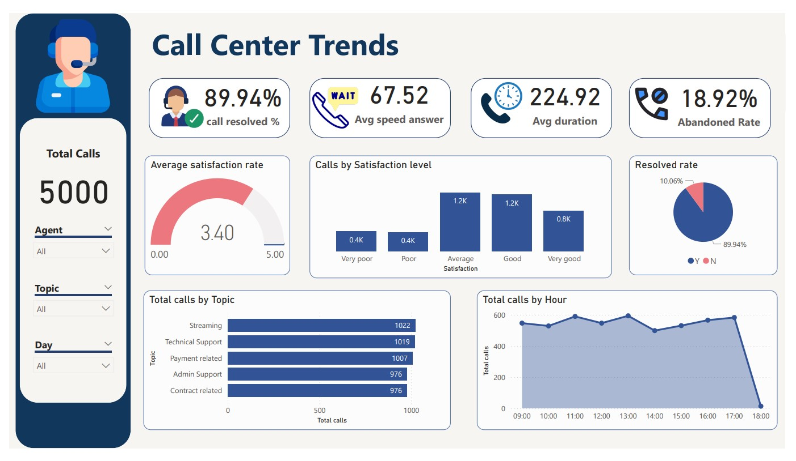

# **Call Center Trends**

The dashboard provides a comprehensive view of call center metrics, focusing on customer satisfaction, call volumes, and agent performance. It aids in identifying areas for improvement in call center operations.

**Objective:** The purpose of this analysis is to create a dashboard in Power BI for Call Center Manager that reflects all relevant Key Performance Indicators (KPIs) and metrics to:

- Self-exploratory call trends
- Overview of the agent’s performance and behaviors
- Overview the customer satisfaction

# **Key Performance Indicators and Metrics:**

**About Calls and Agents:**

- Overall calls answered/abandoned
- Calls received by time, day
- Average speed of answer, handle duration
- Resolved rate by Agents, Topics
- Agent’s performance quadrant -> average handle time (talk duration) vs calls answered

**About Customer satisfaction:**

- Overall customer satisfaction
- Customer satisfaction distribution by Agents, Topics

# **Analysis and Insights**

**About Call trends:**

- The highest abandoned rate is 28.03% between 1:00 pm - 1:30 pm
- Customers have more problems with Streaming service
- The resolved rate is at a high rate (89,94%)

**About performance of agents:**

- The agent who satisfies customers most is Becky with a 12.02% of “Very good” rating
- The agent who has the highest resolved rate is Jim and he is effective with solving problems related to “Contract related” and “Admin Support”

**About customer satisfaction:**

- The average customer satisfaction is at an acceptable rate with 3.40, mainly comes from “Average” (30.04%) and “Good” (29.11%) rating
- The correlation between call answered and call resolved is strongly positive which resulted in an increase in the customer satisfaction rate
